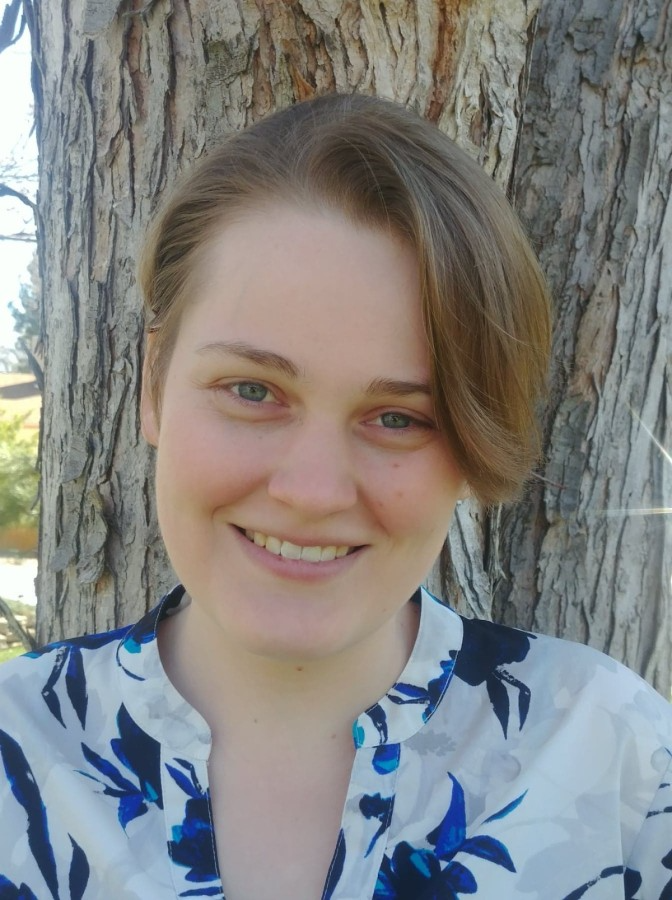

## Laya Buchanan

### About Me
I am current student at the Columbia University Mailman School of Public Health working towards a Master of Public Health graduate in Epidemiology. At the Mailman School, I focus on molecular epidemiology and environmental health. Most recently, I have worked as an intern with the Global Psychiatric Epidemiology group. I am excited to apply the skills and knowledge I have learned at Mailman to a career in public health. 